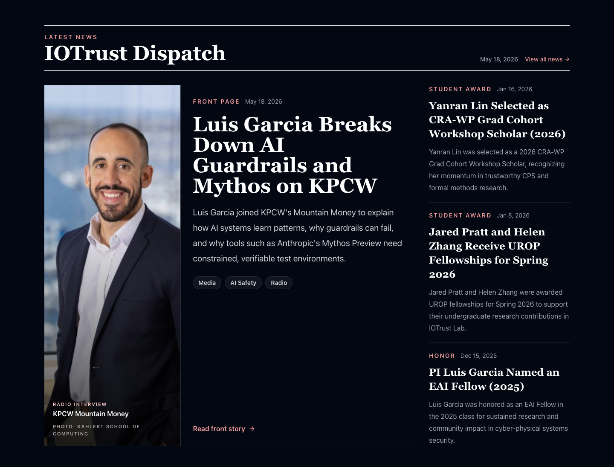
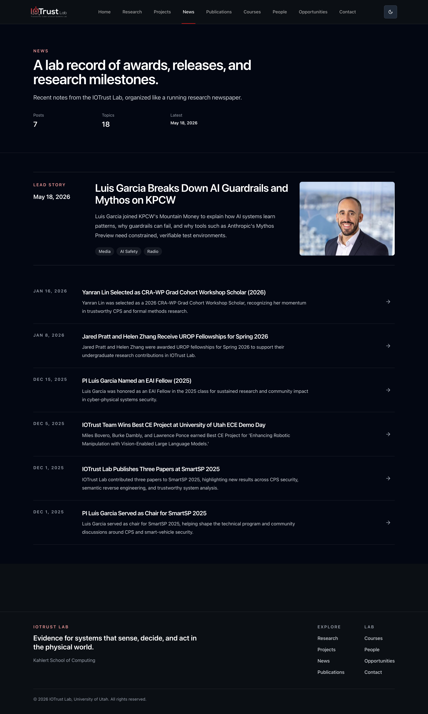

# IOTrust Dispatch — Front-Page Archive

A running collection of the IOTrust Dispatch (`/news`) front page, captured each
time the lead story or the page design changes. Think of it as the lab's shelf of
back issues: a magazine keeps every cover, and so do we. Each entry preserves how
the front page looked at a moment in time, the lead story of that issue, and the
exact commit that produced the design.

## How to add an entry

When the front page changes in a way worth keeping (new design, notable lead
story), capture it before or right after the change:

1. Run the site locally (`npm run dev`) and open `/news`.
2. Screenshot the full front page into `assets/` using the naming pattern
   `dispatch-v<N>-<YYYY-MM-DD>-front-page.png`.
3. Add a section below with the date, the lead story, a one-line note on what is
   distinctive about the design, and the short commit SHA it was captured at.

Keep entries newest-first.

---

## v1 — 2026-07-24 · Serif masthead, KPCW front story

**Front page — home `/#news`:**

**News index — `/news`:**

- **Front story:** *Luis Garcia Breaks Down AI Guardrails and Mythos on KPCW* (May 18, 2026)
- **Design:** The serif **"IOTrust Dispatch"** masthead under a double rule; a
  large "Front Page" lead card (portrait photo with a gradient-overlaid caption
  on the left, headline + summary + tags on the right) beside a column of three
  briefs. The `/news` index mirrors it as a running newspaper — a three-column
  lead band over a divided list of the remaining stories.
- **Captured at:** `e405221` (main, before the PETS 2026 issue).
- **Retired by:** the PETS 2026 issue, which promotes *Jainta Paul Presents
  "Sensor Privacy as a Spectrum" at PETS 2026 in Calgary* to the front story
  (with the Calgary group photo as the cover), makes the front-story cover
  caption data-driven, and extends article pages to carry in-line figures,
  hyperlinks, and citations.
